# LAB5WEB
# PEMOGRAMAN WEB
# TEKNIK INFORMATIKA
# UNIVERSITAS PELITA BANGSA
NAMA    : RISYAD BIMA NUGRAHA
NIM     : 312110039
KELAS   : TI.21.B1

# Langkah-Langkah Praktikum
<b>Membuat Dokumen HTML Pengenalan Javascript<b>
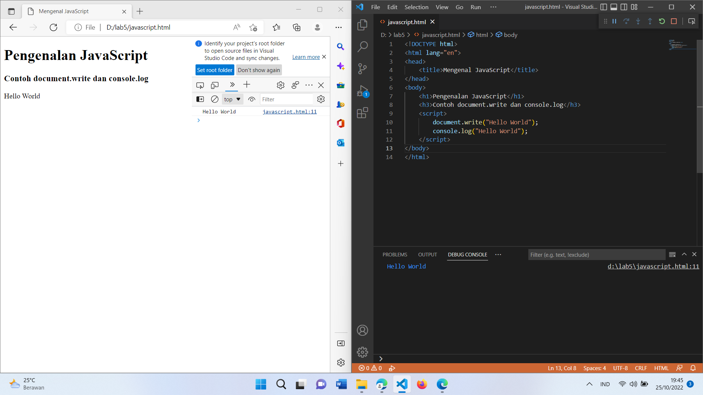
1. Penggunaan Alert
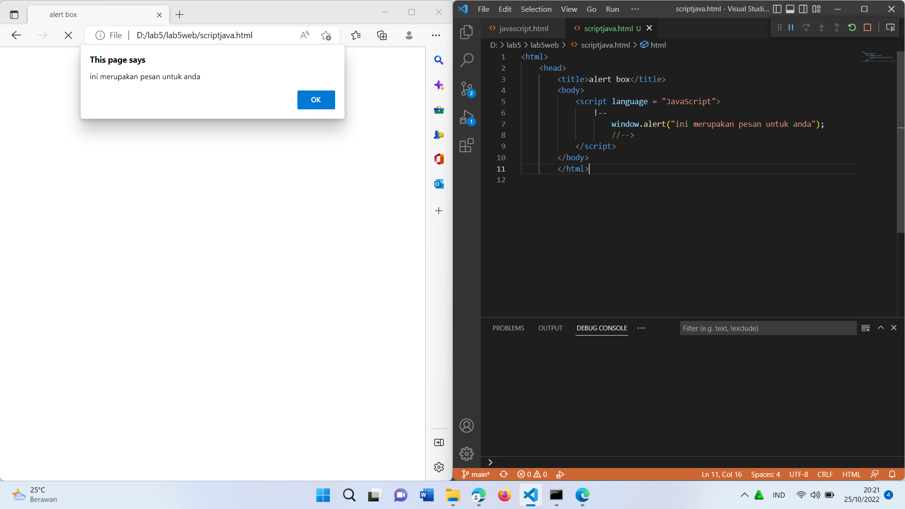
2. Penggunaan Method
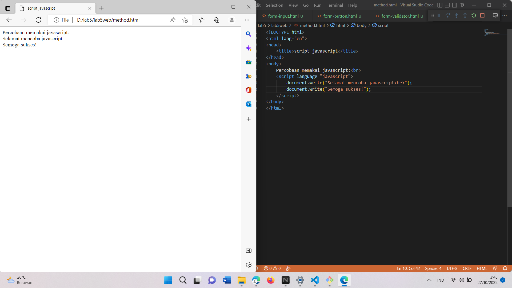
3. Penggunaan Prompt
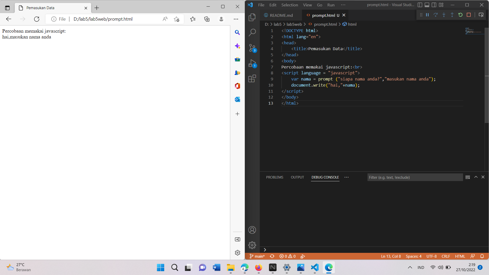
4. Pembuatan Fungsi Dan Cara Pemanggilannya
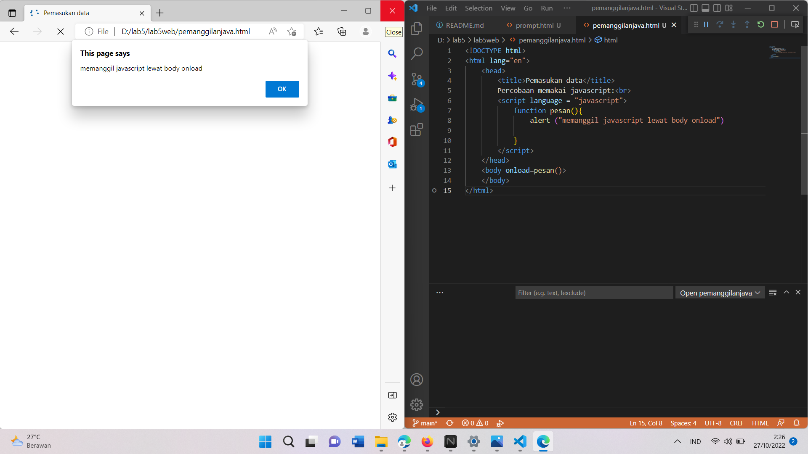
5. Oprasi dasar aritmatika
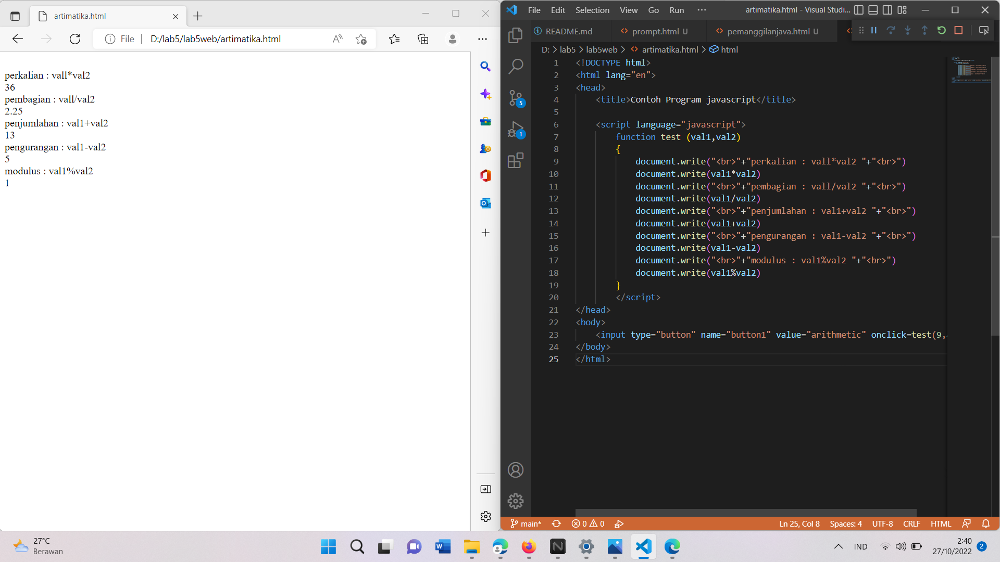
6. seleksi kondisi (if.else)
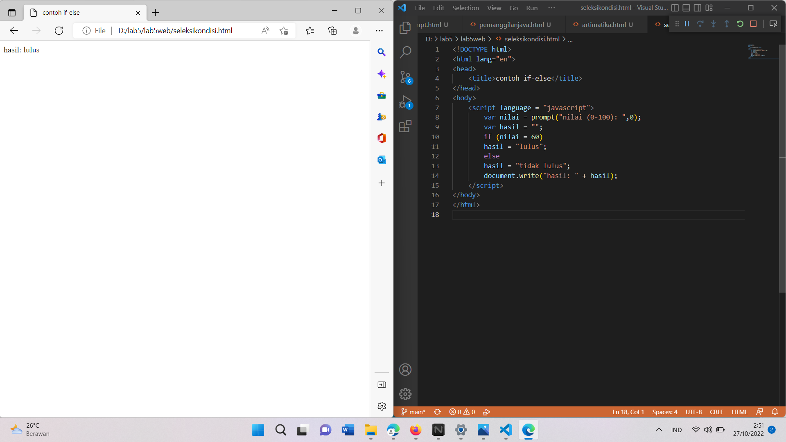
7. Penggunaan Oprator switch untuk seleksi kondisi
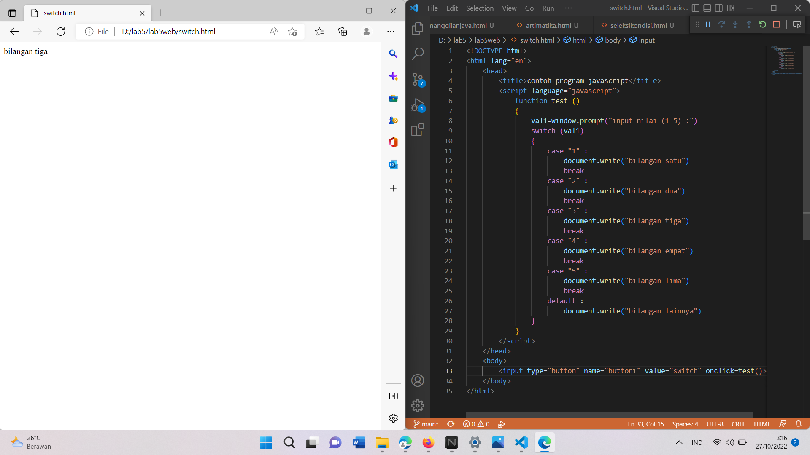
8. Pembuatan Form Input
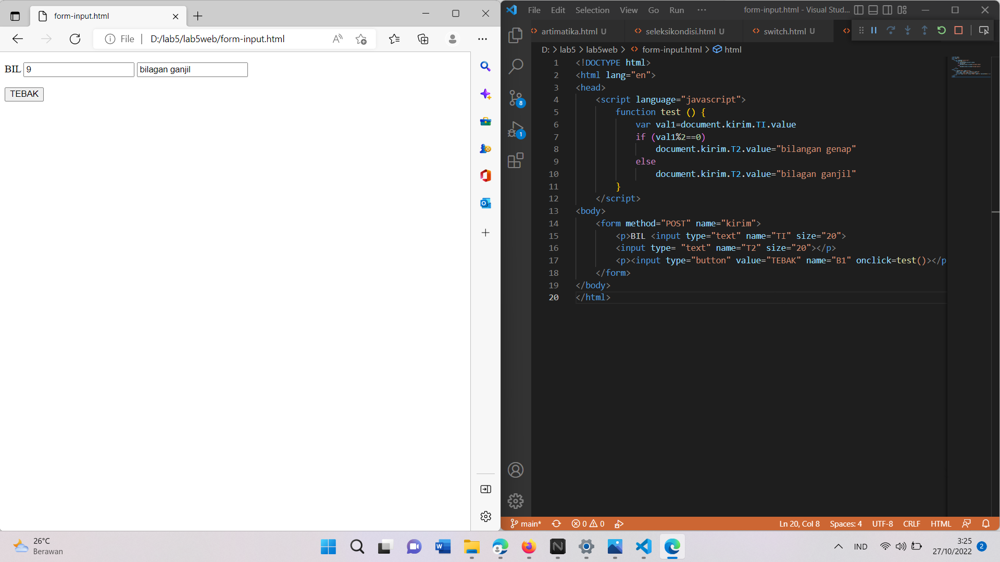
9. Pembuatan Form Button

10. HTML DOM
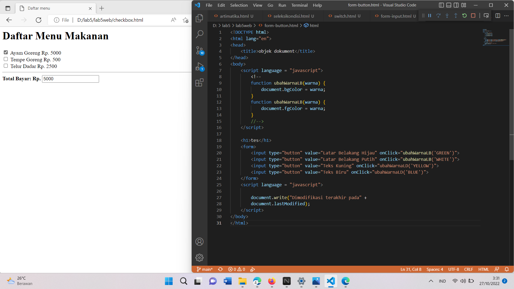
# Pertanyaan dan Tugas
1. Buat script untuk melakukan validasi pada isian form
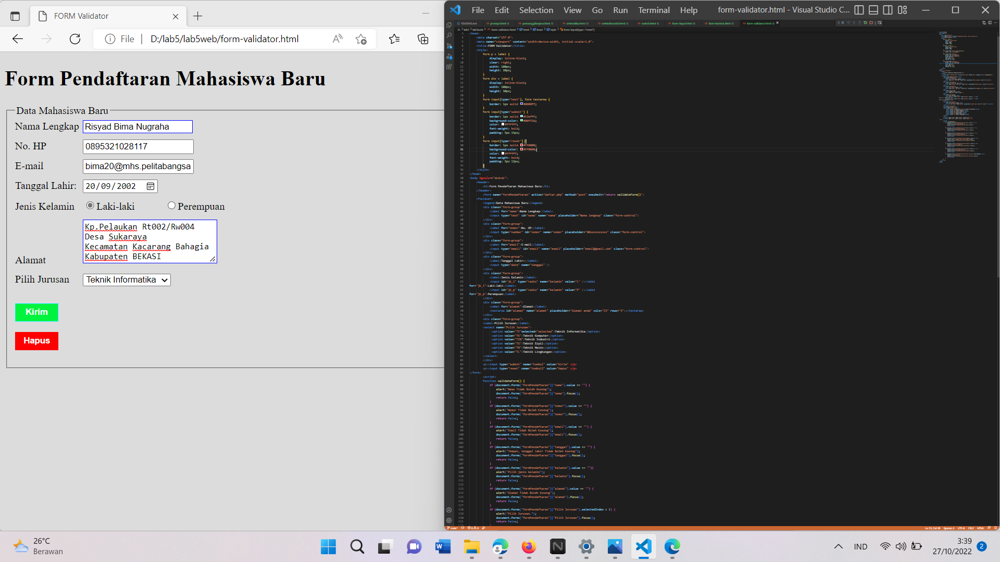
# TERIMAKASI
